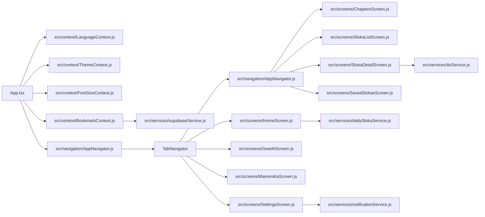
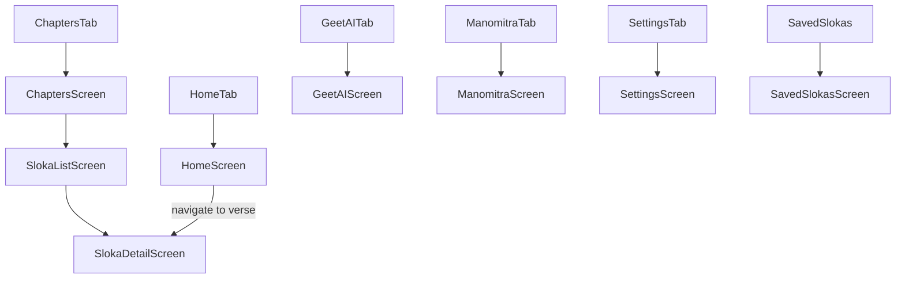
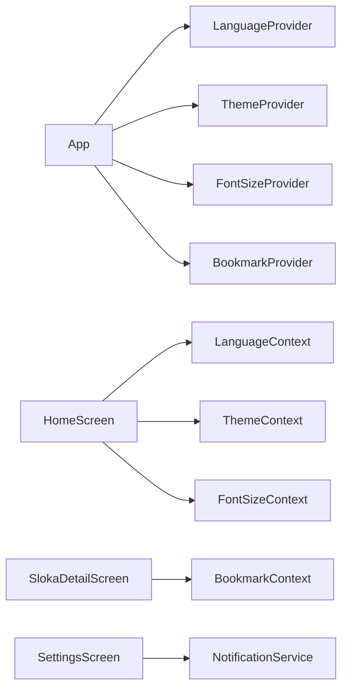
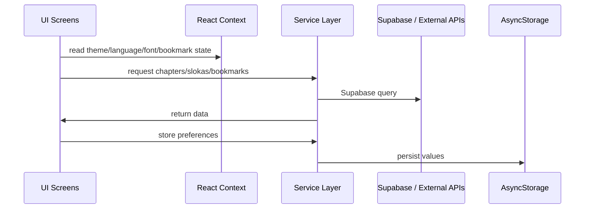
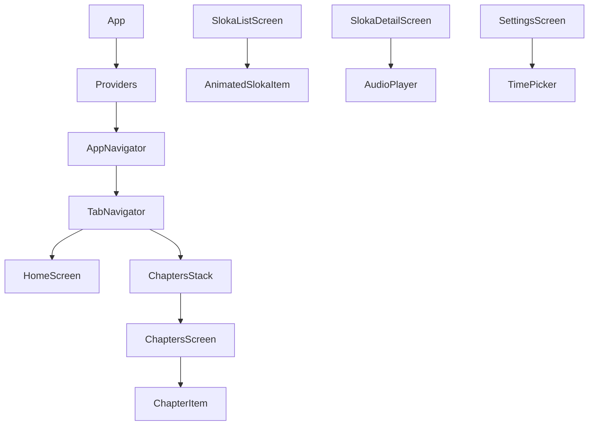

# Dharma - Bhagavad Gita App 🕉️

## 1. Project Overview

- **Project Name:** Dharma
- **Purpose:** A production-grade React Native mobile app for consuming the Bhagavad Gita with daily verses, multilingual support, audio recitation, bookmarks, notifications, and two AI chat assistants.
- **Business Objective:** Provide users with a modern, accessible spiritual learning experience that encourages daily practice, self-reflection, and personalized discovery of the Gita.
- **Main Features:**
  - Daily Bhagavad Gita verse
  - Chapter browsing and verse navigation
  - Verse detail with audio, meaning, and translations
  - Saved verses/bookmarks
  - Settings for theme, language, font size, and notifications
  - Geet AI chat assistant
  - Manomitra chat companion with voice playback
- **Target Users:** Spiritual seekers, mobile readers of the Gita, Hindi/Tamil/Malayalam/Kannada/English readers, audio learners, users who want daily reminders.
- **Technology Stack:** React Native, React Navigation, Supabase, AsyncStorage, Notifee, react-native-sound, Context API.
- **Application Type:** Native mobile application.
- **Supported Platforms:** Android and iOS.
- **Architecture Pattern Used:** Functional component architecture with React Context for app-level state, a service layer for API/storage access, and navigation-based screen composition.
- **High-Level Application Flow:** `App.tsx` loads providers, then `src/navigation/AppNavigator.js` mounts the bottom tab navigator and nested chapter stack.

### Architecture Diagram



---

## 2. Technology Stack

| Category | Technology | Version | Purpose |
|---|---|---|---|
| JavaScript runtime | Node.js | >=22.11.0 | Development toolchain |
| Framework | React Native | 0.85.3 | Core mobile app framework |
| Language | JavaScript / TypeScript | ^5.8.3 (TypeScript support) | Type safety and JSX support |
| Navigation | @react-navigation/native | ^7.2.4 | App navigation container |
| Navigation | @react-navigation/bottom-tabs | ^7.16.1 | Bottom tab navigation |
| Navigation | @react-navigation/native-stack | ^7.15.1 | Stack navigation for chapter flow |
| Backend | @supabase/supabase-js | ^2.105.4 | Supabase database/query client |
| Storage | @react-native-async-storage/async-storage | ^2.0.0 | Local persistence for settings/bookmarks/session |
| Notifications | @notifee/react-native | ^9.1.8 | Local scheduled notifications |
| Audio Playback | react-native-sound | ^0.13.0 | Audio playback for TTS and recitations |
| Native utils | react-native-fs | ^2.20.0 | File I/O for generated TTS audio |
| UI | react-native-vector-icons | ^10.3.0 | Icon library for buttons and UI |
| Webview | react-native-webview | ^13.6.4 | Not used in app screens; present as dependency |
| Polyfill | react-native-url-polyfill | ^3.0.0 | Required for Supabase in React Native |
| Testing | jest | ^29.6.3 | Unit/integration testing framework |
| Testing | @react-native/jest-preset | 0.85.3 | React Native Jest configuration |
| Lint | eslint | ^8.19.0 | JavaScript linting |
| Formatter | prettier | 2.8.8 | Code formatting |

### Why these dependencies are used

- `react-native`: core native runtime.
- `@react-navigation/*`: app screen routing with tabs and nested stacks.
- `@supabase/supabase-js`: database access for chapters, slokas, translations, bookmarks.
- `AsyncStorage`: persistence for theme, language, font, notifications, last read position, device ID.
- `Notifee`: Android and iOS local notification scheduling.
- `react-native-sound`: audio playback of remote MP3 files.
- `react-native-fs`: file system write for TTS audio.
- `react-native-url-polyfill`: required by Supabase SDK on React Native.
- `react-native-vector-icons`: consistent icons across screens.
- `jest`: unit testing.
- `eslint` and `prettier`: code quality and formatting.

---

## 3. Complete Project Structure

```
Dharma/
├── App.tsx
├── app.json
├── babel.config.js
├── jest.config.js
├── metro.config.js
├── package.json
├── react-native.config.js
├── tsconfig.json
├── __tests__/
│   └── App.test.tsx
├── android/
│   ├── app/build.gradle
│   ├── build.gradle
│   └── ...
├── ios/
│   ├── Podfile
│   └── ...
├── src/
│   ├── components/
│   │   ├── AppText.js
│   │   ├── AudioPlayer.js
│   │   ├── ChapterItem.js
│   │   ├── FavoriteButton.js
│   │   ├── Header.js
│   │   ├── MainHeader.js
│   │   ├── SearchBar.js
│   │   └── TimePicker.js
│   ├── config/
│   │   └── supabase.js
│   ├── constants/
│   │   └── colors.js
│   ├── context/
│   │   ├── BookmarkContext.js
│   │   ├── FontSizeContext.js
│   │   ├── LanguageContext.js
│   │   └── ThemeContext.js
│   ├── hooks/
│   │   └── useTranslation.js
│   ├── i18n/
│   │   ├── en.json
│   │   ├── hi.json
│   │   ├── kn.json
│   │   ├── ml.json
│   │   ├── ta.json
│   │   └── te.json
│   ├── navigation/
│   │   └── AppNavigator.js
│   ├── screens/
│   │   ├── ChaptersScreen.js
│   │   ├── GeetAIScreen.js
│   │   ├── HomeScreen.js
│   │   ├── ManomitraScreen.js
│   │   ├── SavedSlokasScreen.js
│   │   ├── SettingsScreen.js
│   │   ├── SlokaDetailScreen.js
│   │   └── SlokaListScreen.js
│   └── services/
│       ├── audioService.js
│       ├── contentService.js
│       ├── dailySlokaService.js
│       ├── fontSizeService.js
│       ├── notificationService.js
│       ├── searchService.js
│       ├── storageService.js
│       ├── supabaseService.js
│       └── ttsService.js
└── patches/ (empty)
```

### Folder Purpose

- `src/components/`: Shared presentation controls used by screens.
- `src/config/`: Third-party configuration and client initialization.
- `src/constants/`: Color palette, spacing, radius tokens.
- `src/context/`: React Context providers for app state.
- `src/hooks/`: Custom reusable hooks.
- `src/i18n/`: Translation dictionaries.
- `src/navigation/`: App navigator and route composition.
- `src/screens/`: Screen-level UI and business flow.
- `src/services/`: Data access, storage, TTS, notifications, and Supabase operations.

---

## 4. Setup Guide

See [`setup.md`](./setup.md) for environment setup, installation, Android/iOS configuration, build commands, and troubleshooting.

---

## 5. Environment Variables Documentation

### Detected Environment Variable Usage

- **Environment variable injection is not implemented in current source code.**
- The app currently contains hard-coded service endpoints in `src/config/supabase.js`, `src/services/ttsService.js`, `src/screens/GeetAIScreen.js`, and `src/screens/ManomitraScreen.js`.

### Recommended `.env.example`

See `.env.example`.

### Environment variable candidates

| Variable | Required | Description | Example | Source File |
|---|---|---|---|---|
| `SUPABASE_URL` | Recommended | Supabase project endpoint | `https://cgzoogirhleteybmkzcv.supabase.co` | `src/config/supabase.js` |
| `SUPABASE_ANON_KEY` | Recommended | Supabase anon public key | `eyJh...` | `src/config/supabase.js` |
| `TTS_API_URL` | Recommended | External text-to-speech endpoint | `https://.../generate-speech` | `src/services/ttsService.js` |
| `MANOMITRA_API_URL` | Recommended | Chatbot backend for Manomitra | `https://.../chatbot` | `src/screens/ManomitraScreen.js` |
| `GEETAI_API_URL` | Recommended | Chat backend for Geet AI | `https://.../chat` | `src/screens/GeetAIScreen.js` |

> Note: the codebase currently uses hard-coded values for these services. Externalize them to `.env` and modify the relevant files for production readiness.

---

## 6. API Documentation

### Overview

The app relies on three categories of APIs:

1. Supabase database access for chapters, slokas, translations, and bookmarks.
2. External TTS service for generating audio.
3. External chat services for Geet AI and Manomitra.

### Master API Table

| Endpoint | Method | Auth | Screen | Service |
|---|---|---|---|---|
| Supabase `chapters` | GET (SDK query) | No | `ChaptersScreen`, `HomeScreen`, `SlokaDetailScreen` | `src/services/supabaseService.js` |
| Supabase `slokas` | GET (SDK query) | No | `ChaptersScreen`, `SlokaListScreen`, `SlokaDetailScreen`, `SavedSlokasScreen` | `src/services/supabaseService.js` |
| Supabase `translations` | GET (SDK query) | No | `SlokaListScreen`, `SlokaDetailScreen`, `SavedSlokasScreen` | `src/services/supabaseService.js` |
| Supabase `bookmarks` | GET/POST/DELETE | No | `BookmarkContext`, `SavedSlokasScreen` | `src/services/supabaseService.js` |
| TTS service | POST | No | `SlokaDetailScreen`, `ManomitraScreen` | `src/services/ttsService.js` |
| Geet AI chat | POST | No | `GeetAIScreen` | `src/screens/GeetAIScreen.js` |
| Manomitra chat | POST | No | `ManomitraScreen` | `src/screens/ManomitraScreen.js` |

### Authentication APIs

No user authentication endpoints exist. The app uses Supabase anonymously and stores a generated local device identifier for bookmarks in `src/services/storageService.js`.

### Supabase APIs

#### Fetch chapters
- **Service function:** `fetchChapters()`
- **File:** `src/services/supabaseService.js`
- **Implementation:**
  - `supabase.from('chapters').select('*').order('chapter_number', { ascending: true })`
- **Usage:** `ChaptersScreen.js`
- **Purpose:** Retrieve chapter metadata for chapter list.

#### Fetch chapter by number
- **Service function:** `fetchChapterByNumber(chapterNumber)`
- **File:** `src/services/supabaseService.js`
- **Implementation:**
  - `supabase.from('chapters').select('*').eq('chapter_number', chapterNumber).maybeSingle()`
- **Usage:** `SlokaDetailScreen.js`

#### Fetch slokas with translations
- **Service function:** `fetchSlokasWithTranslations(chapterNumber, language)`
- **File:** `src/services/supabaseService.js`
- **Logic:**
  - Gets `slokas` for chapter.
  - If `language !== 'en'`, loads matching translation rows from `translations` table.
- **Usage:** `SlokaListScreen.js`

#### Fetch single sloka
- **Service function:** `fetchSloka(chapterNumber, slokaNumber, language)`
- **File:** `src/services/supabaseService.js`
- **Usage:** `SlokaDetailScreen.js`

#### Bookmarks
- `addBookmark(deviceId, slokaId)`
- `removeBookmark(deviceId, slokaId)`
- `fetchBookmarks(deviceId, language)`
- `isBookmarked(deviceId, slokaId)`
- **File:** `src/services/supabaseService.js`
- **Usage:** `src/context/BookmarkContext.js`, `SavedSlokasScreen.js`, `SlokaDetailScreen.js`

### Search APIs

#### Keyword search
- **Service function:** `searchByKeyword(keyword)`
- **File:** `src/services/searchService.js`
- **Query:**
  - `.or('sanskrit_text.ilike.%${keyword}%,transliteration.ilike.%${keyword}%,hindi_meaning.ilike.%${keyword}%,english_meaning.ilike.%${keyword}%')`

#### Search by chapter
- **Service function:** `searchByChapter(chapterNumber)`
- **File:** `src/services/searchService.js`

#### Search by sloka number
- **Service function:** `searchBySloka(chapterNumber, slokaNumber)`
- **File:** `src/services/searchService.js`

### Daily Sloka APIs

#### Fetch daily sloka
- **Service function:** `fetchDailySloka(language)`
- **File:** `src/services/dailySlokaService.js`
- **Persistence:** Caches daily verse in AsyncStorage using keys `@daily_sloka` and `@last_sloka_update`.
- **Logic:** Advances verse each day and retains last shown verse.

### TTS API

#### Generate meaning audio
- **Service function:** `generateMeaningAudio(text, languageCode)`
- **File:** `src/services/ttsService.js`
- **Endpoint:** `https://exact-punisher-judicial.ngrok-free.dev/generate-speech`
- **Payload:** `{ text, language }`
- **Returns:** Local file URL written via `react-native-fs`.
- **Usage:** `SlokaDetailScreen.js`, `ManomitraScreen.js`

### AI Chat APIs

#### Manomitra chatbot
- **Screen:** `src/screens/ManomitraScreen.js`
- **Endpoint:** `https://affection-unspoiled-gatherer.ngrok-free.dev/chatbot`
- **Payload:** `{ message }`
- **Response:** Expects JSON with `reply`, `response`, or `message`.

#### Geet AI chat
- **Screen:** `src/screens/GeetAIScreen.js`
- **Endpoint:** `https://pacifist-varsity-probe.ngrok-free.dev/chat`
- **Payload:** `{ question }`
- **Response:** Expects JSON with `answer` or `response`.

### API Usage Notes

- The app does not currently use build-time environment variables.
- Supabase access is public via anon key.
- External chat/TTS services use hard-coded ngrok URLs.
- No auth headers are present for these endpoints.

---

## 7. Authentication Documentation

### Authentication System

- **Current state:** No user authentication or login/signup flow is implemented.
- **Session handling:** The app uses a locally-generated device ID to associate bookmarks.
- **Secure storage:** Device ID and preferences are stored in AsyncStorage.

### Bookmark/session details

- `getDeviceId()` in `src/services/storageService.js` generates an ID when needed:
  - If `@dharma_user_id` exists, reuse it.
  - Otherwise create `device_${Date.now()}_${random}` and save it.
- Bookmarks are associated with `device_id` in Supabase.

### Token lifecycle

- Not applicable. There is no JWT or OAuth session.

### Protected routes

- No protected routes are implemented.

---

## 8. Navigation Documentation

### Navigator structure

- `src/navigation/AppNavigator.js`
- Bottom tab navigator with tabs:
  - `HomeTab` → `HomeScreen`
  - `ChaptersTab` → nested stack `ChaptersStack`
  - `GeetAITab` → `GeetAIScreen`
  - `ManomitraTab` → `ManomitraScreen`
  - `SettingsTab` → `SettingsScreen`

- `ChaptersStack` contains:
  - `ChaptersList` → `ChaptersScreen`
  - `SlokaList` → `SlokaListScreen`
  - `SlokaDetail` → `SlokaDetailScreen`

- Hidden route:
  - `SavedSlokas` → `SavedSlokasScreen` is rendered from the Stack but hidden from the bottom tabs.

### Navigation flow diagram



### Route table

| Route | Screen | Access Level |
|---|---|---|
| `HomeTab` | `src/screens/HomeScreen.js` | Public |
| `ChaptersTab` | `src/screens/ChaptersScreen.js` | Public |
| `SlokaList` | `src/screens/SlokaListScreen.js` | Public |
| `SlokaDetail` | `src/screens/SlokaDetailScreen.js` | Public |
| `GeetAITab` | `src/screens/GeetAIScreen.js` | Public |
| `ManomitraTab` | `src/screens/ManomitraScreen.js` | Public |
| `SettingsTab` | `src/screens/SettingsScreen.js` | Public |
| `SavedSlokas` | `src/screens/SavedSlokasScreen.js` | Public |

---

## 9. Screen Documentation

### HomeScreen
- **File:** `src/screens/HomeScreen.js`
- **Purpose:** Shows the daily sloka, last-read quick access, navigation cards to chapters and AI features.
- **UI Overview:** hero card for today’s verse, continue reading card, explore tiles.
- **State Used:** `dailySloka`, `lastRead`, `loading`, `refreshing`, `error`, `showAudioPlayer`.
- **Hooks Used:** `useFontSize`, `useTranslation`, `useLanguage`, `useTheme`.
- **Components Used:** `AudioPlayer`.
- **APIs Used:** `fetchDailySloka()` from `src/services/dailySlokaService.js`; `getLastRead()` from `src/services/storageService.js`.
- **Navigation Targets:** `ChaptersTab -> SlokaDetail`.
- **Business Logic:** refresh daily verse when language changes; the card uses cached daily verse data.

### ChaptersScreen
- **File:** `src/screens/ChaptersScreen.js`
- **Purpose:** Displays the list of Bhagavad Gita chapters and allows chapter search.
- **UI Overview:** search bar, tab toggle for all vs saved, animated chapter cards.
- **State Used:** `chapters`, `filteredChapters`, `loading`, `refreshing`, `error`, `activeTab`, `searchQuery`.
- **Hooks Used:** `useTranslation`, `useLanguage`, `useFontSize`, `useTheme`.
- **Components Used:** `SearchBar`, `ChapterItem`.
- **APIs Used:** `fetchChapters()` from `src/services/supabaseService.js`.
- **Navigation Targets:** `SlokaList`.

### SlokaListScreen
- **File:** `src/screens/SlokaListScreen.js`
- **Purpose:** Shows all verses in a selected chapter.
- **UI Overview:** list of verses, loading and refresh state, animated list.
- **State Used:** `slokas`, `loading`, `refreshing`.
- **Hooks Used:** `useTranslation`, `useLanguage`, `useFontSize`, `useTheme`, `useBookmarks`.
- **Components Used:** `ChapterItem` indirectly via list, `AnimatedSlokaItem` internal component.
- **APIs Used:** `fetchSlokasWithTranslations()` from `src/services/supabaseService.js`.
- **Navigation Targets:** `SlokaDetail`.

### SlokaDetailScreen
- **File:** `src/screens/SlokaDetailScreen.js`
- **Purpose:** Display a single verse with translation, audio, bookmark toggling, and meaning audio playback.
- **UI Overview:** header with back/bookmark, verse card, audio player, meaning card, TTS controls.
- **State Used:** `sloka`, `chapter`, `loading`, `userId`, `error`, `ttsLoading`, `ttsError`, `meaningAudioUrl`.
- **Hooks Used:** `useTranslation`, `useLanguage`, `useFontSize`, `useTheme`, `useBookmarks`.
- **Components Used:** `AudioPlayer`.
- **APIs Used:** `fetchSloka()`, `fetchChapterByNumber()` from `src/services/supabaseService.js`; `saveLastRead()` from `src/services/storageService.js`; `generateMeaningAudio()` from `src/services/ttsService.js`.
- **Business Logic:** Save last read location, toggle bookmark optimistically, translate content by language.

### SavedSlokasScreen
- **File:** `src/screens/SavedSlokasScreen.js`
- **Purpose:** Show bookmarked verses saved by the local device ID.
- **UI Overview:** list of saved slokas, remove bookmark action, empty state.
- **Hooks Used:** `useBookmarks`, `useTranslation`, `useLanguage`, `useFontSize`, `useTheme`.
- **Components Used:** `SavedSlokaItem` internal component.
- **APIs Used:** bookmark state functions in `src/context/BookmarkContext.js`.

### GeetAIScreen
- **File:** `src/screens/GeetAIScreen.js`
- **Purpose:** Chat interface for Geet AI questions.
- **UI Overview:** chat stream, input box, send button, suggestion chips.
- **State Used:** `messages`, `inputText`, `isLoading`.
- **Hooks Used:** `useTranslation`, `useFontSize`, `useTheme`.
- **APIs Used:** POST to `https://pacifist-varsity-probe.ngrok-free.dev/chat`.
- **Business Logic:** Append user and bot messages and show network errors.

### ManomitraScreen
- **File:** `src/screens/ManomitraScreen.js`
- **Purpose:** Conversational companion with voice playback support.
- **UI Overview:** chat bubbles, text input, TTS play/stop button.
- **State Used:** `messages`, `inputText`, `isLoading`, `isSpeakingId`.
- **Hooks Used:** `useTranslation`, `useFontSize`, `useLanguage`, `useTheme`.
- **APIs Used:** POST to `https://affection-unspoiled-gatherer.ngrok-free.dev/chatbot`; `generateMeaningAudio()`.

### SettingsScreen
- **File:** `src/screens/SettingsScreen.js`
- **Purpose:** Control app appearance, language, notifications, and text scaling.
- **UI Overview:** toggles for theme and notifications, font controls, language selector, about card.
- **State Used:** `notificationsEnabled`, `notificationTime`, `showTimePicker`, `showLanguagePicker`.
- **Hooks Used:** `useTranslation`, `useLanguage`, `useFontSize`, `useTheme`.
- **APIs Used:** `getNotificationEnabled()`, `saveNotificationEnabled()`, `getNotificationTime()`, `saveNotificationTime()` from `src/services/storageService.js`; `scheduleNotification()`, `cancelNotifications()`, `requestNotificationPermission()`, `createNotificationChannel()` from `src/services/notificationService.js`.

---

## 10. Component Documentation

### AppText
- **File:** `src/components/AppText.js`
- **Purpose:** Centralized text component that uses scaled font sizes from `FontSizeContext`.
- **Props:** `style`, `variant`, `children`.
- **Variants:** `base`, `small`, `heading`, `title`, `sanskrit`, `large`.

### AudioPlayer
- **File:** `src/components/AudioPlayer.js`
- **Purpose:** Plays remote audio URLs, shows progress, and provides retry support.
- **Props:** `audioUrl`, `duration`, `chapterNumber`, `verseNumber`, `autoPlay`.
- **Dependencies:** `react-native-sound`, `useTheme`.

### ChapterItem
- **File:** `src/components/ChapterItem.js`
- **Purpose:** Displays chapter metadata with localized title and verse count.
- **Props:** `chapter`, `onPress`, `scaledSizes`, `language`.
- **Dependencies:** `getChapterName` from `src/services/contentService.js`.

### FavoriteButton
- **File:** `src/components/FavoriteButton.js`
- **Purpose:** Bookmark icon button used to mark verses.
- **Props:** `isFavorite`, `onPress`.

### Header
- **File:** `src/components/Header.js`
- **Purpose:** General top bar with optional back and action icons.
- **Props:** `title`, `onBackPress`, `rightIcon`, `onRightPress`.

### MainHeader
- **File:** `src/components/MainHeader.js`
- **Purpose:** Custom app header used across many stack screens, with side drawer menu.
- **Dependencies:** `react-native-safe-area-context`, `useTranslation`, `useTheme`, `useNavigation`.
- **Notes:** Builds a slide-out menu and navigates to tab routes.

### SearchBar
- **File:** `src/components/SearchBar.js`
- **Purpose:** Search input for chapter list filtering.
- **Props:** `onSearch`, `placeholder`.

### TimePicker
- **File:** `src/components/TimePicker.js`
- **Purpose:** Modal time selector for notification scheduling.
- **Props:** `visible`, `onClose`, `onSelect`, `initialTime`, `isDark`, `scaledSizes`.

---

## 11. State Management Documentation

### Patterns

- The app uses React Context and Hooks.
- No Redux, Redux Toolkit, MobX, or Zustand.
- Context providers are mounted in `App.tsx`.

### Providers

- `LanguageProvider` (`src/context/LanguageContext.js`): saves `language` and translation dictionary.
- `ThemeProvider` (`src/context/ThemeContext.js`): saves theme toggle state and derived palette values.
- `FontSizeProvider` (`src/context/FontSizeContext.js`): saves `fontSize` and `scaledSizes`.
- `BookmarkProvider` (`src/context/BookmarkContext.js`): manages bookmarks with Supabase and local device ID.

### Store Structure

- `LanguageContext` stores:
  - `language`
  - `translations`
  - `changeLanguage()`
- `ThemeContext` stores:
  - `isDark`
  - `toggleTheme()`
  - `theme` palette object
- `FontSizeContext` stores:
  - `fontSize`
  - `scaledSizes`
  - `updateFontSize()`
- `BookmarkContext` stores:
  - `bookmarks`
  - `loading`
  - `toggleBookmark()`
  - `isSlokaBookmarked()`
  - `refreshBookmarks()`

### State Flow Diagram



---

## 12. Hooks Documentation

### useTranslation
- **File:** `src/hooks/useTranslation.js`
- **Purpose:** Provide a localized translation function using current language dictionary.
- **Parameters:** None.
- **Returns:** `(key: string) => string`
- **Usage:** `const t = useTranslation(); t('nav.home')`.
- **Dependencies:** `useLanguage()`.

---

## 13. Services Documentation

### Supabase service
- **File:** `src/services/supabaseService.js`
- **Purpose:** Primary data access for chapters, slokas, translations, bookmarks.
- **Methods:**
  - `fetchChapters()`
  - `fetchChapterByNumber(chapterNumber)`
  - `fetchSlokasWithTranslations(chapterNumber, language)`
  - `fetchSloka(chapterNumber, slokaNumber, language)`
  - `addBookmark(deviceId, slokaId)`
  - `removeBookmark(deviceId, slokaId)`
  - `fetchBookmarks(deviceId, language)`
  - `isBookmarked(deviceId, slokaId)`
- **Error Handling:** logs to console and returns empty values or `null`.

### Storage service
- **File:** `src/services/storageService.js`
- **Purpose:** Local persistence of theme, language, notifications, last read, and device identifier.
- **Keys:** `@dharma_theme`, `@dharma_language`, `@dharma_notification_time`, `@dharma_notification_enabled`, `@dharma_last_read`, `@dharma_user_id`.

### Search service
- **File:** `src/services/searchService.js`
- **Purpose:** Query Supabase by keyword, chapter, or sloka number.
- **Methods:** `searchByKeyword`, `searchByChapter`, `searchBySloka`.

### Daily sloka service
- **File:** `src/services/dailySlokaService.js`
- **Purpose:** Provide verse-of-the-day functionality with local caching.
- **Methods:** `fetchDailySloka(language)`, `resetDailySloka()`.

### TTS service
- **File:** `src/services/ttsService.js`
- **Purpose:** Generate MP3 audio from text and save to local cache.
- **Endpoint:** `https://exact-punisher-judicial.ngrok-free.dev/generate-speech`
- **Methods:** `generateMeaningAudio(text, languageCode)`, `stopMeaningAudio()`.

### Audio service
- **File:** `src/services/audioService.js`
- **Purpose:** Setup background playback event handling for TrackPlayer.
- **Methods:** `setupPlayer()`, `playbackService()`.

### Notification service
- **File:** `src/services/notificationService.js`
- **Purpose:** Request permissions, create channels, schedule daily reminders, cancel notifications.
- **Methods:** `requestNotificationPermission()`, `createNotificationChannel()`, `scheduleNotification(hour, minute)`, `cancelNotifications()`.

### Font size service
- **File:** `src/services/fontSizeService.js`
- **Purpose:** Store and compute font scaling values.
- **Constants:** `MIN_FONT_SIZE=12`, `MAX_FONT_SIZE=24`, `DEFAULT_FONT_SIZE=16`.
- **Methods:** `getScaledSizes(baseSize)`, `getFontSize()`, `saveFontSize(size)`.

### Content service
- **File:** `src/services/contentService.js`
- **Purpose:** Localize chapter and sloka text for supported languages.
- **Methods:** `getChapterName(chapter, language)`, `getSlokaText(sloka, translation, language)`, `getMeaning(sloka, translation, language)`.

---

## 14. External Integrations

### Supabase
- **Purpose:** data storage for chapters, slokas, translations, and bookmarks.
- **Config file:** `src/config/supabase.js`
- **Official docs:** https://supabase.com/docs
- **Dashboard:** https://app.supabase.com/
- **Required env:** `SUPABASE_URL`, `SUPABASE_ANON_KEY` (currently hard-coded).
- **Notes:** Uses async-storage session persistence.

### Notifee
- **Purpose:** schedule local notifications.
- **Config file:** `src/services/notificationService.js`
- **Official docs:** https://notifee.app/
- **Required env:** none.

### Audio & TTS services
- **Purpose:** remote TTS generation and playback.
- **Config file:** `src/services/ttsService.js`
- **Endpoint:** `https://exact-punisher-judicial.ngrok-free.dev/generate-speech`
- **Official docs:** Not available in repo (custom service).

### AI chat backends
- **Manomitra**
  - Endpoint: `https://affection-unspoiled-gatherer.ngrok-free.dev/chatbot`
  - Screen: `src/screens/ManomitraScreen.js`
- **Geet AI**
  - Endpoint: `https://pacifist-varsity-probe.ngrok-free.dev/chat`
  - Screen: `src/screens/GeetAIScreen.js`

### React Native Vector Icons
- **Purpose:** iconography throughout mobile UI.
- **Docs:** https://github.com/oblador/react-native-vector-icons

### react-native-sound
- **Purpose:** audio playback on iOS/Android.
- **Docs:** https://github.com/zmxv/react-native-sound

### react-native-fs
- **Purpose:** store generated audio locally.
- **Docs:** https://github.com/itinance/react-native-fs

---

## 15. Permissions Documentation

### Android
- `NOTIFICATION` via Notifee.
- `READ/WRITE_EXTERNAL_STORAGE` are implied by `react-native-fs` usage, although not explicitly referenced in JS.
- Permissions handled by native modules and manifest defaults.

### iOS
- No explicit `Info.plist` permission keys are defined in source file inspection.
- Standard microphone/notification permissions are managed by React Native modules.

### Used Screens
- `SettingsScreen.js` triggers notification permission requests.
- `SlokaDetailScreen.js` and `ManomitraScreen.js` use audio playback.

---

## 16. Local Storage Documentation

### AsyncStorage
- **Implementation:** `@react-native-async-storage/async-storage`
- **Used in:** `src/services/storageService.js`, `src/services/fontSizeService.js`, `src/services/dailySlokaService.js`, `src/config/supabase.js`.
- **Keys stored:**
  - `@dharma_theme`
  - `@dharma_language`
  - `@dharma_notification_time`
  - `@dharma_notification_enabled`
  - `@dharma_last_read`
  - `@dharma_user_id`
  - `@daily_sloka`
  - `@last_sloka_update`
  - `@font_size_numeric`

### Security notes
- Sensitive keys are currently stored in source, not in environment variables.
- AsyncStorage is not encrypted.

---

## 17. Configuration Files Documentation

### package.json
- Defines dependencies, `scripts` for android/ios lint/start/test, and `postinstall` uses `patch-package`.
- No Expo.

### tsconfig.json
- Extends `@react-native/typescript-config`.
- Includes `.ts` and `.tsx` files.

### babel.config.js
- Uses `module:@react-native/babel-preset`.

### metro.config.js
- Merges default Metro config.

### react-native.config.js
- Disables autolinking for `react-native-sound` on Android.

### app.json
- Contains app name and display name.

### Android config
- `android/build.gradle`: compile SDK 36, min SDK 24, target SDK 36.
- `android/app/build.gradle`: applicationId `com.dharma`, debug signing config, manual `react-native-sound` linking.

### iOS config
- `ios/Podfile`: default React Native pod setup, no custom native pods beyond React Native.

---

## 18. Build & Deployment Guide

### Install dependencies
```bash
npm install
```

### iOS pods
```bash
npx pod-install
```

### Run development
```bash
npm start
npm run android
npm run ios
```

### Android release
```bash
cd android
./gradlew assembleRelease
```

### iOS release
- Open `ios/Dharma.xcworkspace` in Xcode.
- Configure signing and provisioning.
- Archive for App Store distribution.

### Notes
- The release build currently uses debug keystore in `android/app/build.gradle`.
- A production signing identity and keystore are not configured in source.

---

## 19. Testing Documentation

### Unit tests
- One Jest test exists: `__tests__/App.test.tsx`.
- Test runs with `npm test`.

### Commands
- `npm test`
- `npm run lint`

### Coverage
- No coverage reports configured.

### Missing test layers
- No integration or E2E test suite detected.

---

## 20. Security Documentation

### Authentication security
- No user auth implemented.
- Supabase anon key is hard-coded.

### Sensitive data handling
- Service URLs and keys are in source files.
- Recommendation: migrate them to `.env` and `process.env`.

### Input validation
- Minimal validation exists on chat input fields.
- Sloka route parameters are checked for existence.

### Secure storage
- AsyncStorage is used, which is not encrypted.
- Recommendation: use SecureStore or MMKV for secret values.

---

## 21. Utilities Documentation

### Content helpers
- `src/services/contentService.js` maps app language codes to database language labels and formats sloka text.

### Storage utilities
- `src/services/storageService.js` persists theme, language, notification preferences, last read position, and device ID.

### Font scaling
- `src/services/fontSizeService.js` calculates responsive font sizes from base size.

---

## 22. Constants Documentation

### Colors and UI tokens
- `src/constants/colors.js` defines `COLORS`, `RADIUS`, and `SPACING`.
- Used across every screen and component.

---

## 23. Assets Documentation

- No image, icon, font, or Lottie asset files are present inside `src/`.
- Icon fonts are loaded from `react-native-vector-icons`.
- Audio assets are streamed or generated at runtime.

---

## 24. Error Handling Documentation

- API call errors are logged with `console.error`.
- UI screens show retry state and error messages for load failures.
- `SupabaseService` swallows errors and returns fallback values.
- No global error boundary or crash reporting is configured.

---

## 25. Logging & Monitoring

- Only native `console.*` logging is used.
- No analytics, crash reporting, or monitoring SDKs were detected.

---

## 26. Performance Optimization Documentation

- `FlatList` is used in chapter and saved verse lists.
- `React.useMemo` and `React.useCallback` are used in key screens to avoid re-renders.
- Audio and chat network calls are performed asynchronously.

---

## 27. Architecture Documentation

### Data Flow Diagram



### Component Hierarchy



---

## 28. Troubleshooting Guide

### Common setup issues
- `npm install` fails: ensure Node.js 22.11.0+.
- `npx pod-install` fails: run from project root and install CocoaPods.
- Android emulator issues: ensure `ANDROID_HOME` or `ANDROID_SDK_ROOT` is set.

### Build errors
- `react-native-sound` may require manual Android linking via `react-native.config.js`.
- `Pod install` errors may indicate missing Xcode command line tools.

### Notification issues
- Android notifications require `requestNotificationPermission()` and a channel created by `createNotificationChannel()`.

### Runtime network issues
- AI and TTS endpoints are hard-coded on ngrok domains; these may expire.

---

## 29. Dependency Documentation

| Package | Version | Purpose | Used In |
|---|---|---|---|
| `react-native` | 0.85.3 | Mobile runtime | App |
| `@react-navigation/native` | ^7.2.4 | Navigation container | `src/navigation/AppNavigator.js` |
| `@react-navigation/bottom-tabs` | ^7.16.1 | Bottom tabs | `src/navigation/AppNavigator.js` |
| `@react-navigation/native-stack` | ^7.15.1 | Native stack navigation | `src/navigation/AppNavigator.js` |
| `@supabase/supabase-js` | ^2.105.4 | Supabase client | `src/config/supabase.js` |
| `@react-native-async-storage/async-storage` | ^2.0.0 | Local persistence | storage services |
| `@notifee/react-native` | ^9.1.8 | Notifications | `src/services/notificationService.js` |
| `react-native-sound` | ^0.13.0 | Audio playback | `src/components/AudioPlayer.js` |
| `react-native-fs` | ^2.20.0 | File writing | `src/services/ttsService.js` |
| `react-native-url-polyfill` | ^3.0.0 | URL polyfill for Supabase | `src/config/supabase.js` |
| `react-native-vector-icons` | ^10.3.0 | Icons | multiple components |
| `jest` | ^29.6.3 | Unit testing | `__tests__/App.test.tsx` |

---

## 30. Release Checklist

- [ ] External endpoints configured for production.
- [ ] `SUPABASE_URL` / `SUPABASE_ANON_KEY` externalized.
- [ ] Notification scheduling tested on Android and iOS.
- [ ] Audio playback verified on device.
- [ ] Translation/localization verified across supported languages.
- [ ] Build passes on Android and iOS.
- [ ] `npm test` passes.
- [ ] No hard-coded API keys remain in source.
- [ ] Release signing credentials configured.
- [ ] Notifications and permission flows validated.

---

## 31. README Generation

This file is the consolidated documentation generated from the codebase.

---

## 32. Missing Information

- Production API URL → Not Found in Codebase
- CI/CD Configuration → Not Found in Codebase
- Sentry or crash reporting setup → Not Found in Codebase
- Analytics SDK integration → Not Found in Codebase
- OAuth / Login / Signup flows → Not Found in Codebase
- Environment variable loading system → Not Found in Codebase
- iOS permission keys in Info.plist for camera/microphone/notifications → Not Found in Codebase
- Native release signing setup for production keystore → Not Found in Codebase

---

## Appendix: Key Source Files

- `App.tsx`
- `src/navigation/AppNavigator.js`
- `src/config/supabase.js`
- `src/services/supabaseService.js`
- `src/services/ttsService.js`
- `src/services/dailySlokaService.js`
- `src/services/storageService.js`
- `src/context/LanguageContext.js`
- `src/context/ThemeContext.js`
- `src/context/FontSizeContext.js`
- `src/context/BookmarkContext.js`
- `src/screens/HomeScreen.js`
- `src/screens/ChaptersScreen.js`
- `src/screens/SlokaListScreen.js`
- `src/screens/SlokaDetailScreen.js`
- `src/screens/SavedSlokasScreen.js`
- `src/screens/SettingsScreen.js`
- `src/screens/GeetAIScreen.js`
- `src/screens/ManomitraScreen.js`

